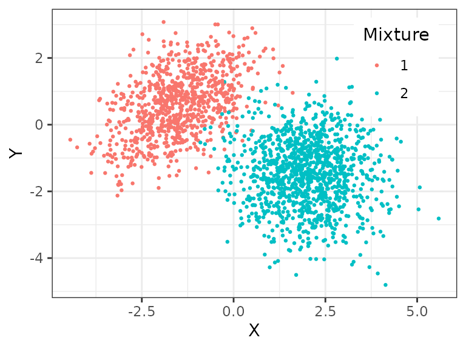
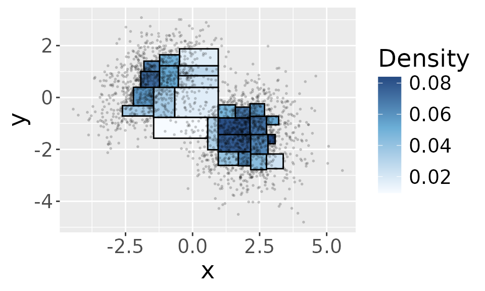
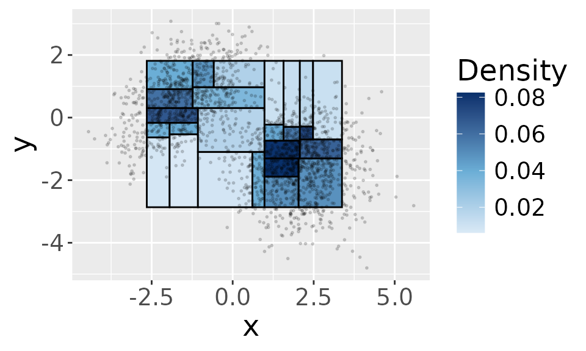
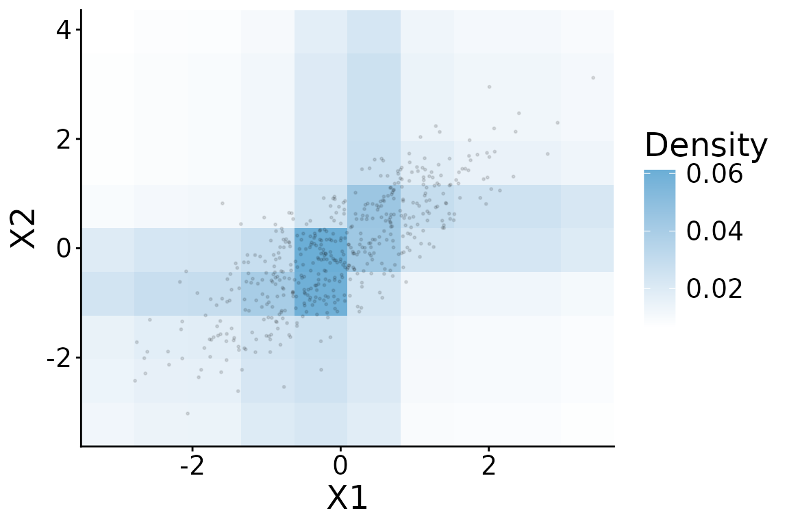

# Creating a Beta Tree Histogram

First introduced by Pearson in 1895, the histogram is one of the basic
tools for summarizing and visualizing data. In order to construct a
histogram for univariate data, one first defines a set of “bins” (i.e.,
intervals), and then counts the number of observations within each bin.
We can do the same for two- or higher- dimensional data. However, as the
dimension increases, creating a histogram becomes challenging because of
the *curse of dimensionality*. In essence, if we use the same number of
bins in each dimension, then in order to have the same number of
observations per bin as in the univariate setting, the sample size needs
to increase *exponentially* with the dimension.

The Beta-tree histogram circumvents the curse of dimensionality by
adapting the histogram to the data. Instead of predefining the locations
of the bins, the Beta-tree histogram recursively partitions the space
according to the marginal *order statistics*. The Beta-tree histogram
has three properties:

- It **adapts** to where observations are located.

- It provides **simultaneous** confidence intervals for the probability
  mass in each bin of the histogram.

- It **summarizes** data succinctly by choosing the largest bins such
  that data are close to uniform in each bin.

The simultaneous confidence intervals (CI) created by the Beta-tree
histogram also allow us to perform various data-analytic tasks, such as
identifying modes in the underlying density. This is described in the
note “Identifying modes using a Beta-tree histogram”.

This document demonstrates how to use functions in the package to create
a Beta-tree histogram using data from of a mixture of 2-dimensional
Gaussian distributions.

## Example: Creating a Beta-tree histogram for 2-dim Gaussian data

As an illustration, we create a Beta-tree histogram for a mixture of
two-dimensional Gaussian data ($n =$ 2000) sampled from the following
distribution and visualized below:

$$\frac{2}{5}N\left( \begin{pmatrix}
{- 1.5} \\
0.6
\end{pmatrix},\begin{pmatrix}
1 & 0.5 \\
0.5 & 1
\end{pmatrix} \right) + \frac{3}{5}N\left( \begin{pmatrix}
2 \\
{- 1.5}
\end{pmatrix},\begin{pmatrix}
1 & 0 \\
0 & 1
\end{pmatrix} \right),$$



We use the
[`BuildHist()`](https://zq00.github.io/BetaTree/reference/BuildHist.md)
function to create a Beta-tree histogram. (If `plot = T`, then the
function plots the Beta-tree histogram if the data are two-dimensional.
)

``` r
hist <- BuildHist(X, alpha = 0.1, method = "weighted_bonferroni", plot = T)
```



Besides the data matrix `X`, we input two parameters: the significance
level `alpha = 0.1` and a multiple testing correction method
`method = "weighted_bonferroni"`. This means that the confidence
intervals that the histogram provides are simultaneously valid for every
region (i.e. bin) at confidence level `1-alpha = 0.9`. The return value
of the `BuildHist` is a matrix describing each region in the Beta-tree
histogram. Each row represents one region, and this histogram includes
26 regions. Let’s look at the first region in the histogram:

``` r
hist[1,]
#> [1] -2.61449293 -0.71307863 -1.45076293 -0.31525842  0.03456057  0.01762324
#> [7]  0.05868752 31.00000000  6.00000000
```

The columns provide the following information:

- the first two columns are the lower bounds in $x$ and $y$-coordinates
  for this region; the next two columns are the upper bounds in $x$ and
  $y$-coordinates for this region, i.e., this rectangle is defined by
  the bounds \[ -2.61 -1.45 \] \*\[ -0.71 -0.32 \]. If the data have a
  higher dimension, then there would be correspondingly more columns.

- the fifth column stores the empirical density for this region

- the sixth and seventh columns store the lower and upper confidence
  bound (CI) of the average probability density in the region. With
  probability at least $(1 - \alpha)$, the CIs cover the average
  densities in all of the regions.

- the eighth column stores the number of observations in this region

- the last column stores the depth of the region in the k-d tree, which
  we will describe in the next section.

The histogram above does not have a rectangular boundary. As we will
explain in the next few sections, this is because the histogram only
includes **bounded** regions. Alternatively, you can initialize a
bounding box for the histogram if you specify `bounded = T`. You will
then need to provide two additional parameters `option` and `q` (which
we will explain in the next section). Below, we initialize the bounding
box at the 0.05 and 0.95 quantiles in each dimension.

``` r
hist <- BuildHist(X, alpha = 0.1, method = "weighted_bonferroni", bounded = T, 
                  option = "qt", q=c(0.05,0.05), 
                  plot = TRUE)
```



In the next section, we will describe how the Beta-tree histogram is
constructed.

## How a Beta-tree histogram is constructed

The Beta tree histogram is constructed in four steps:

1.  Building a k-d tree.
2.  Calculating confidence levels for every region.
3.  Setting confidence bounds.
4.  Select regions that pass a goodness-of-fit test.

You can think of the algorithm as taking two passes: a top-down pass
partitioning the sample space into small regions and a bottom-up pass
selecting largest regions in which the observations are approximately
uniform.

## Building a k-d tree

The construction of the Beta-tree histogram starts by iteratively
partitioning the sample space along the marginal sample medians. This is
motivated by [k-d trees](https://en.wikipedia.org/wiki/K-d_tree), which
is a spatial-partitioning data structure for organizing observations in
a k-dimensional space.

In detail, we start with all of the observations (this is the root
node). At each step, we choose (1) an axis along which to partition and
(2) a location for partitioning. For (1), we iterate through all of the
coordinates, i.e., the first partition is along $x$-axis and the second
partition is along the $y$-axis etc. As to (2), we partition along the
sample *median* in the partitioning coordinate.

In the two-dimensional example above, in the first partition, we split
the sample space into two half-spaces:
$$R_{1} = \{ x \in {\mathbb{R}}^{2}:x_{1} < X_{1,\lceil{n/2}\rceil}\},\quad R_{2} = \{ x \in {\mathbb{R}}^{2}:x_{1} > X_{1,\lceil{n/2}\rceil}\}$$
Note that the observations at the sample median are not included in any
of the two regions. In the second step, we split $R_{1}$ and $R_{2}$
respectively. $R_{1}$ is split into two children
$$R_{3} = \{ x \in R_{1}:x_{2} < X_{2,\lceil{n_{1}/2}\rceil}^{1}\},\quad R_{4} = \{ x \in R_{1}:x_{2} > X_{2,\lceil{n_{1}/2}\rceil}^{1}\},$$
where $X_{2,\lceil{n_{1}/2}\rceil}^{1}$ is the $\lceil{n_{1}/2}\rceil$
order statistic in the $y$-coordinate for the observations $X^{1}$ in
$R_{1}$ (the total number of observations in $R_{1}$ is $n_{1}$). We
continue splitting a region until the number of observations inside is
less than $4\log n$, where $n$ is the total number of observations.

The function `BuildKDTree` constructs a k-d tree.

``` r
tree <- BuildKDTree(X, bounded = F)
```

The `tree` object has two components: `kdtree` and `nd`. The object
`kdtree` stores the root node of k-d tree as a list (you can refer to
the function documentation for more detail). We point out here that
`leftchild` and `rightchild` point to the two partitions of that region,
`low` ad `up` are the lower and upper bounds of the region and `ndat` is
the number of observations. The following is one node in the tree:

``` r
tree$kdtree$leftchild$leftchild$rightchild$rightchild$leftchild$leftchild
#> $leftchild
#> NULL
#> 
#> $rightchild
#> NULL
#> 
#> $ndat
#> [1] 30
#> 
#> $depth
#> [1] 6
#> 
#> $low
#> [1] -1.4507629 -0.7649166
#> 
#> $up
#> [1] -0.6637458 -0.0331637
#> 
#> $lower
#> NULL
#> 
#> $upper
#> NULL
#> 
#> $bounded
#> [1] 1
#> 
#> $leaf
#> [1] TRUE
```

`nd` contains the number of *bounded* regions at depth $d$ of the tree
(the root node has depth = 0). This is useful when we adjust the
confidence levels at each depth to account for multiple CI. Here, at
depth 4 there are 4 bounded regions.

``` r
tree$nd
#> [1]  0  0  0  0  4 12 36 21
```

As you can see, there are no bounded regions in the first 4 levels. You
can initialize a bounding box with the option `bounded = T` . This
restricts the histogram construction to the data inside the bounding
box. We provide two options to specify the bounding box:

1.  If `option = 'qt'`, then we set the bounds at the sample quantiles.
    For example, if `q = c(0.05, 0.05)`, then we construct the bounding
    box $R_{0}$ as follows: The vertical boundaries of $R_{0}$ are given
    by the 0.05 and 0.95 quantiles of the data in the x-coordinate.
    Denote the data that fall strictly between these vertical boundaries
    by $X^{1}$. The horizontal boundaries of $R_{0}$ are given by the
    0.05 and 0.95 quantiles of $X^{1}$ in the y coordinate. The root
    node $R_{0}$ is the interior of this bounding box.

&nbsp;

2.  If `option = 'ndat'`, then we specify the number of observations
    rather than the quantiles. For example, if `q = c(25, 25)`, then the
    vertical boundaries of $R_{0}$ have x-coordinates equal to the 25th
    smallest and 25th largest x-coordinates of the data $X$.

## Calculating confidence levels for every region

We are able to construct exact CI for the probability content of every
region because the probability of a region $R_{k}$ satisfies

$$F\left( R_{k} \right) \sim {Beta}\left( n_{k} + 1,n - n_{k} \right),$$
where $n_{k}$ is the number of observations in $R_{k}$ and $n$ is the
total number of observations. With this result, we can construct a
$(1 - \alpha)$ confidence interval for the average density
$f\left( R_{k} \right) = F\left( R_{k} \right)/\left| R_{k} \right|$,
where $\left| R_{k} \right|$ denotes the volume of $R_{k}$:

$$\left( \frac{{qBeta}\left( \frac{\alpha}{2},n_{k} + 1,n - n_{k} \right)}{\left| R_{k} \right|},\frac{{qBeta}\left( 1 - \frac{\alpha}{2},n_{k} + 1,n - n_{k} \right)}{\left| R_{k} \right|} \right).$$

If we want to simultaneously cover all the regions at level
$(1 - \alpha)$, then we can redefine the significance level for each
region such that the total probability of mis-coverage is at most
$\alpha$. For example, we can use a **weighted Bonferroni** adjustment:
We assign the same level for every bounded region at the same tree
depth, and this significance level for regions at tree depth $D$ is
defined as $\alpha_{D}$,

$${\widehat{\alpha}}_{D} = \frac{\alpha}{N_{D}\left( D_{\max} - D + 2 \right)\sum\limits_{B = 2}^{D_{\max} - D_{\min} + 2}\frac{1}{B}},\quad D \geq D_{\min}$$

Here, $D_{\max}$ is the maximum depth of the k-d tree, $D_{\min}$ is the
smallest depth (greater than 0) at which there are bounded regions,
$N_{D}$ is the number of *bounded* regions at depth $D$, and the factor
$\sum_{B = 2}^{D_{\max} - D_{\min} + 2}\frac{1}{B}$ ensures that
${\widehat{\alpha}}_{D}$ adds up to $\alpha$.

The function `ConfLevel` computes ${\widehat{\alpha}}_{D}$ for each
depth $D$ and for a given overall level $\alpha$. For example, the
following code computes ${\widehat{\alpha}}_{D}$ when $\alpha = 0.1$.
You can also use an unweighted Bonferroni adjustment by setting
`method = 'bonferroni'`. The unweighted Bonferroni adjustment gives
equal weight to each tree depth, and then equal weight to all bounded
regions at the same tree depth.

``` r
ahat <- ConfLevel(tree$nd, alpha = 0.1, method = "weighted_bonferroni")
ahat
#> [1] 0.0000000000 0.0000000000 0.0000000000 0.0000000000 0.0038961039
#> [6] 0.0016233766 0.0007215007 0.0018552876
```

## Setting confidence bounds

Once we define the confidence levels, we compute simultaneous confidence
intervals for the average densities $f\left( R_{k} \right)$ as

$$\left( \frac{{qBeta}\left( \frac{{\widehat{\alpha}}_{D}}{2},n_{k} + 1,n - n_{k} \right)}{\left| R_{k} \right|},\frac{{qBeta}\left( 1 - \frac{{\widehat{\alpha}}_{D}}{2},n_{k} + 1,n - n_{k} \right)}{\left| R_{k} \right|} \right).$$

In order to construct the Beta-tree histogram, we will use a bottom-up
pass to select the largest regions for which we are confident that the
observations inside are from a uniform distribution. We implement this
idea by picking the largest $R_{k}$ whose empirical density
$h_{k} = \frac{n_{k} + 1}{n\left| R_{k} \right|}$ falls inside the CIs
of all of its children. These intersection bounds can be computed
recursively as

\$\$ \mathrm{lower}(R_k) =
\max\left(\frac{\mathrm{qBeta}(\frac{\hat{\alpha}\_D}{2}, n_k + 1,
n-n_k)}{\|R_k\|}, \mathrm{lower}(\text{1st child}),
\mathrm{lower}(\text{2nd child})\right)\\ \mathrm{upper}(R_k) =
\min\left(\frac{\mathrm{qBeta}(1-\frac{\hat{\alpha}\_D}{2}, n_k + 1,
n-n_k)}{\|R_k\|}, \mathrm{upper}(\text{1st child}),
\mathrm{upper}(\text{2nd child})\right) \$\$

The function `SetBounds` computes these bounds. Let’s compare to the
same node in the k-d tree as before. Whereas the `lower` and `upper`
levels were empty before, the two values are now filled in.

``` r
tree <- SetBounds(tree$kdtree, ahat, n)
```

``` r
tree$leftchild$leftchild$rightchild$rightchild$leftchild$leftchild
#> $leftchild
#> NULL
#> 
#> $rightchild
#> NULL
#> 
#> $ndat
#> [1] 30
#> 
#> $depth
#> [1] 6
#> 
#> $low
#> [1] -1.4507629 -0.7649166
#> 
#> $up
#> [1] -0.6637458 -0.0331637
#> 
#> $lower
#> [1] 0.0135554
#> 
#> $upper
#> [1] 0.04605867
#> 
#> $bounded
#> [1] 1
#> 
#> $leaf
#> [1] TRUE
```

## Selecting regions to form the Beta tree histogram

The function `SelectNodes` selects the largest regions (w.r.t inclusion)
such that the empirical density $h_{k}$ falls inside the interval
$\left\lbrack {lower}\left( R_{k} \right),{upper}\left( R_{k} \right) \right\rbrack$.

``` r
B <- matrix(nrow = 0, ncol = (2*d + 5)) 
hist <- SelectNodes(tree, B, ahat, n)
```

Each row in the `hist` matrix represents one region in the Beta-tree
histogram. The matrix contains $2 \times d + 5$ columns. The first
$2 \times d$ columns store the lower (first $d$ columns) and upper
bounds of the region. The $(2d + 1)$ column stores the empirical density
$h_{k}$ and the next two columns store the confidence interval of
$f\left( R_{k} \right)$ as defined in the previous section:
$$\left( \frac{{qBeta}\left( \frac{{\widehat{\alpha}}_{D}}{2},n_{k} + 1,n - n_{k} \right)}{\left| R_{k} \right|},\frac{{qBeta}\left( 1 - \frac{{\widehat{\alpha}}_{D}}{2},n_{k} + 1,n - n_{k} \right)}{\left| R_{k} \right|} \right).$$

The last two columns store the number of observations inside the region
and its tree depth. The function `BuildHist` returns `hist`.

## Adaptive Beta-tree histogram

When we construct the $k$-d tree described before, we iterate through
each coordinate ($1,2,3,\ldots,d,1,2,\ldots$) and partition at the
sample medians. Sometimes it can be beneficial to choose partition
dimensions *adaptively*, for example, when only a few coordinates are
correlated and the remaining coordinates are from a uniform
distribution.

The adaptive Beta-tree algorithm chooses partition dimension of a region
$R$ by testing marginal uniformity and pairwise independence:

- First, we use Anderson-Darling statistics to test whether the $i$-th
  coordinate $X_{i}$ follows a uniform distribution marginally
  conditional on $X \in R$. We randomly choose a coordinate that
  significantly differs from a uniform distribution.

- Second, if no rejections is made in the first step, we test pairwise
  independence of $X_{i}$ and $X_{j}$ by using Fisher’s exact test to
  the counts in the four quadrants of $i$-th and $j$-th coordinate. The
  four quadrants are defined by dividing $R$ along the middle of the
  $i$-th and $j$-th coordinate. We combine the $(d - 1)$ p-values for
  the $i$-th coordinate as
  $$p_{i} = \sum\limits_{j \neq i}\log p_{i,j}$$ and we randomly choose
  a coordinate with $p_{i} \geq \tau$ for some threshold $\tau$ to
  partition.

As an example, we simulate 5-dimensional observations where only the
first two coordinates are correlated.

``` r
n <- 10000
p <- 5
X <- matrix(rnorm(n*p), n, p)
X[,1:2] <- X[,1:2] %*% chol(matrix(c(1, 0.8, 0.8, 1), 2, 2))
```

We can compute an adaptive Beta-tree histogram using
`build_adaptive_histogram` function.

``` r
alpha <- 0.1 
adaptive_beta_tree <- build_adaptive_histogram(X, 
                                               alpha  = alpha,
                                               thresh_marginal = alpha / ncol(X),
                                               thresh_interaction = qgamma(shape = ncol(X) - 1,rate = 1, p = 1 - alpha),
                                               method = "weighted_bonferroni")
```

There are five parameters for this function:

- `X` is the data matrix

- `alpha` is the significance level, by default `alpha=0.1`.

- `thresh_marginal` is the p-value threshold for testing marginal
  uniformity, by default this is `alpha / d` (`d = ncol(X)`).

- `thresh_interaction` is the threshold for $p_{i}$ for testing pairwise
  independence, by default this is the $1 - \alpha$ quantile of a gamma
  distribution with shape parameter $d - 1$ and rate parameter 1.

- `method` specifies the approach used to correct for multiple
  hypothesis testing as before.

You can visualize the estimated distribution using the functions
`plot_histogram_data` (to prepare data for plotting) and
`plot_histogram` (to create the plot). You can use these functions to
compute the marginal distribution or the conditional distribution within
a given hyperrectangle. Below, we visualize the estimated marginal
distribution in $\left( X_{1},X_{2} \right)$ and plot a subsample of 500
observations.

``` r
plot_dat <- plot_histogram_data( X = X,
                                 hist   = adaptive_beta_tree$hist,
                                 plot_coord = c(1, 2),
                                 nint  = 10,
                                 show_data  = TRUE,
                                 ndat     = 500)
plot_histogram(plot_dat)
```



We can see that the adaptive histogram is able to capture the
correlation between $X_{1}$ and $X_{2}$ in the five dimensional data.
