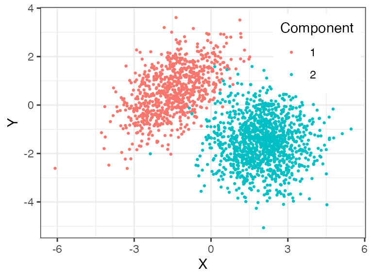
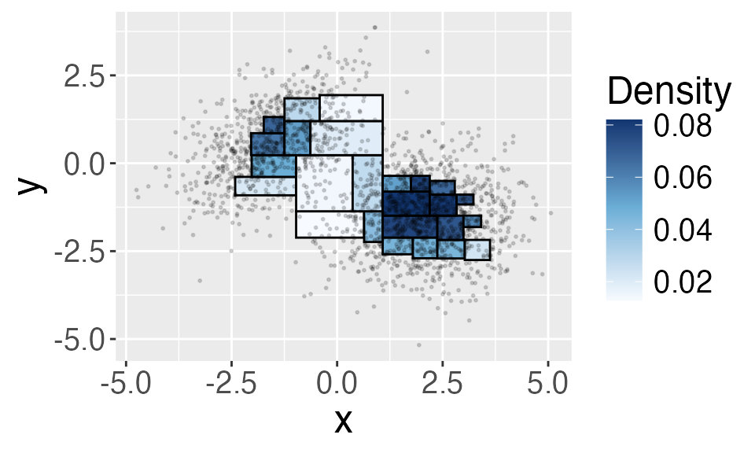
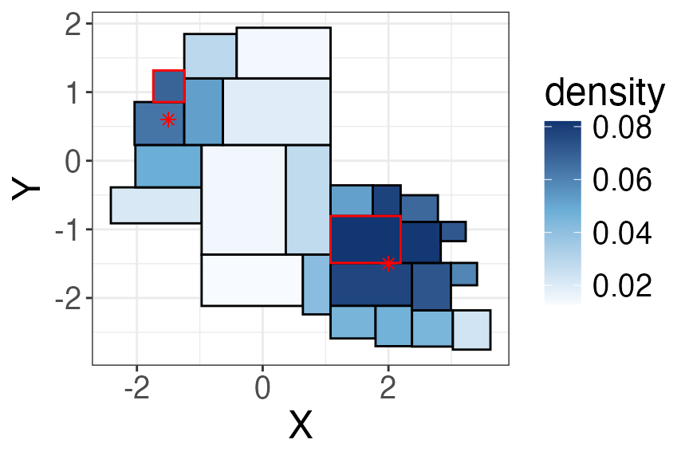
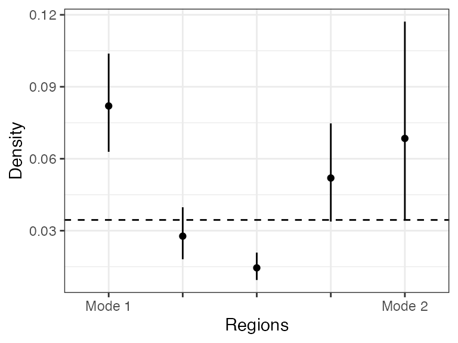

# Mode Hunting Using Beta-Trees

In this vignette, we will demonstrate how to use a Beta-tree histogram
to identify modes in a continuous probability distribution.

The mode of a continuous probability distribution is a local maxima of
the probability density. For example, the following plot shows the
density contours of a mixture of 2-dim Gaussian and the asterisks
indicate the two modes of the density function. We are often interested
to identify modes in a distribution because they indicate
sub-populations (here, the two modes indicate the two mixture
components).

    ## Warning: Using `size` aesthetic for lines was deprecated in ggplot2 3.4.0.
    ## ℹ Please use `linewidth` instead.
    ## This warning is displayed once every 8 hours.
    ## Call `lifecycle::last_lifecycle_warnings()` to see where this warning was
    ## generated.



For a histogram, we can think of a mode as a region whose average
density is higher compared to its neighbors. Put in a different way,
suppose two regions $`R_1`$ and $`R_2`$ are distinct modes, then along
any path connecting $`R_1`$ and $`R_2`$ there exists at least one region
$`R`$ whose average density is lower than those of both $`R_1`$ and
$`R_2`$.

## Example: Detecting modes in a mixture of 2-dim Gaussian

In this example, we simulate $`n=`$ 2000 obs. from a 2-dim Gaussian
mixture we showed before

``` math

\frac{2}{5} {N}\left(\left(\begin{matrix}-1.5 \\0.6\end{matrix}\right),\left(\begin{matrix}1 & 0.5 \\ 0.5 & 1\end{matrix}\right) \right) + \frac{3}{5} {N}\left(\left(\begin{matrix}2 \\-1.5\end{matrix}\right),\left(\begin{matrix}1 & 0 \\ 0 & 1\end{matrix}\right) \right), 
```

We will start by creating a Beta-tree histogram. Here, we set the
confidence level `alpha = 0.1` and we use the weighted Bonferroni method
for multiple testing correction. The densities are higher in the upper
left and the lower right regions, suggesting there are two modes in the
distribution.

``` r
hist <- BuildHist(X, alpha = 0.1, method = "weighted_bonferroni", plot= T)
```



We use the [`FindModes()`](../reference/FindModes.md) function to
identify modes in a Beta-tree histogram. This function has three
parameters, the first is the Beta-tree histogram (output of the
`BuildHist` function), the second is the data dimension `d`, and the
third is the cutoff value of the path length (we only check paths whose
length is at most `cutoff`). We set `cutoff=1000` here, which means we
will look at every path between two regions. However, it might be
infeasible to check every path because of computational restraint, so
typically we would set a smaller cutoff, e.g., `cutoff = 6`.

``` r
modes <- FindModes(hist = hist, d = d, cutoff = 1000)
```

The `FindModes` function returns a list with three components: `mode`
returns the index of the modes, `hist` returns the input histogram, and
`g` returns the adjacency graph of regions in the histogram.

``` r
modes$mode # which regions are the modes?
```

    ## [1] 20  8

``` r
hist[modes$mode, 1:4] # lower and upper bounds of the two modes
```

    ##           [,1]       [,2]      [,3]       [,4]
    ## [1,]  1.079403 -1.4891923  2.193951 -0.8053697
    ## [2,] -1.738694  0.8557582 -1.246862  1.3160574

We highlight the two modes in the histogram, and the asterisks are the
two true modes. The two modes in the Beta-tree histogram are close to
the actual modes in the distribution.



In the next section, we describe details of the `FindModes` function.

## Identifying modes of a Beta-tree histogram

Let’s rephrase the question of mode detection as the following: how can
we tell that the two regions highlighted in red (let’s call them $`R_1`$
and $`R_2`$) are two distinct modes? (If we know how to do this, then we
can detect modes by iterating through all the regions , compare each one
with the current list of distinct modes, and declare it a mode if it is
distinct from all the current modes.) Suppose that $`R_1`$ and $`R_2`$
are distinct modes, then along every path that connects $`R_1`$ and
$`R_2`$, there should exist at least one region $`R`$ whose average
density is lower than those of both $`R_1`$ and $`R_2`$. Because the
Beta-tree histogram returns a CI for the average density, we compare the
lower and upper bound of the CI, that is, there should exist a region
$`R`$ such that

``` math

\mathrm{CI}_\mathrm{up}(R) < \min(\mathrm{CI}_\mathrm{low}(R_1), \mathrm{CI}_\mathrm{low}(R_2)),
```
where $`[\mathrm{CI}_\mathrm{low}(R), \mathrm{CI}_\mathrm{up}(R)]`$ is
the confidence interval of the average density of $`R`$.

For example, we plot the confidence intervals for every region along the
shortest path $`R_1`$ and $`R_2`$. As we can see, the upper confidence
bound of the third region is below the lower endpoints of both modes.
Suppose this is true for every path, then we declare $`R_1`$ and $`R_2`$
are two distinct modes.



Note that we have only examined one path here, and to check every path,
we use the function [`is_connected()`](../reference/is_connected.md). It
returns `connected` if the two regions are **not** distinct modes. The
function has five input values: `i` and `j` are the indices of the two
regions, `g` is a graph based on the adjacency matrix (we will describe
later), `ci` are the lower and upper confidence bounds, and `cutoff`
specifies the maximum length of path the function checks.

``` r
is_connected(i = modes$mode[1], j = modes$mode[2], g = g, ci = hist[,6:7], cutoff = 6)
```

    ## [1] "unconnected"

We need the adjacency matrix in order to compute the path between two
regions. The function
[`compute_adjacency_mat()`](../reference/compute_adjacency_mat.md)
computes the adjacency matrix for all of the regions in the histogram.
The two inputs of the function is a Beta-tree histogram `hist` and data
dimension `d`. In the output adjacency matrix $`A`$, $`A_{i,j} = 1`$ if
$`i`$-th and $`j`$-th regions are neighbors and 0 otherwise. We say that
$`R_1`$ and $`R_2`$ are neighbors if
``` math

[x^{\mathrm{low}}_{1,j}, x^{\mathrm{up}}_{1,j}] \cap [x^{\mathrm{low}}_{2,j}, x^{\mathrm{up}}_{2,j}] \neq \emptyset,\quad \forall j=1,\ldots, d. 
```
Here, we represent each region by the lower and upper bound in each
coordinate, i.e., $`R_1`$ can be represented as
$`(x^{\mathrm{low}}_{1,1}, x^{\mathrm{up}}_{1,1})\times \ldots \times (x^{\mathrm{low}}_{1,d}, x^{\mathrm{up}}_{1,d})`$.

``` r
adj <- compute_adjacency_mat(hist = hist, d = d) 
adj[1:5, 1:5] 
```

    ##      [,1] [,2] [,3] [,4] [,5]
    ## [1,]    0    1    0    0    1
    ## [2,]    1    0    0    0    1
    ## [3,]    0    0    0    1    1
    ## [4,]    0    0    1    0    0
    ## [5,]    1    1    1    0    0

From the adjacency matrix, we compute an undirected graph `g` (using the
function `graph_from_adjacency_matrix` from the `igraph` package).

``` r
g <- igraph::graph_from_adjacency_matrix(adj, mode = "undirected")
```

To summarize, `FindModes` proceeds in the following steps:

1.  Order regions by the empirical density (in descending order).
    Initiate the list of modes by the region with the highest density.

2.  Iterate through every region by the order given in (1), test if it
    is a *distinct mode* from the current list of modes using
    `is_connected` function. If it is `unconnected` from all the current
    modes, then we add it to the list of modes.

3.  Return the list of modes.
